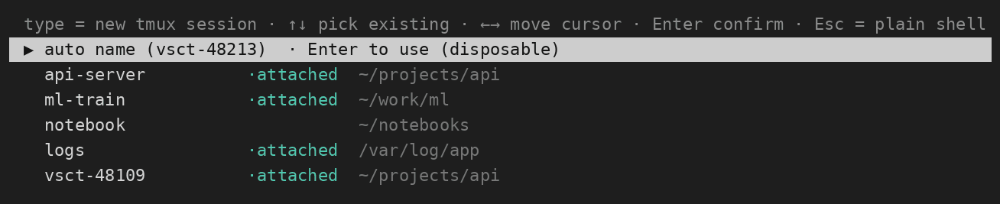
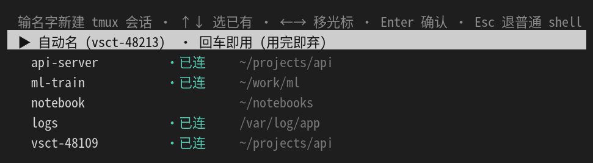

[English](README.md) | [中文](README.zh-CN.md)

# vscode-tmux-picker

A tiny **pre-attach tmux session picker** for the VS Code integrated terminal.
Pure bash, zero dependencies: no fzf, no Go binary.

Open a terminal and, *before* it attaches to tmux, you get an in-terminal menu:
type a name to create a new session, or arrow-pick an existing one (with its
attached state and working directory shown). The point: every terminal runs
*transparently* in tmux, so what's running survives window reloads, quitting VS
Code, SSH drops, and even shutting your laptop down.



The UI follows your system locale. Chinese locale → Chinese interface:



## Why

VS Code does not keep remote terminal processes alive across reconnects or
window reloads. The highest-voted, still-open request on the VS Code remote
backlog is [vscode-remote-release#3096][3096] (open for years). The usual
workaround is to run every integrated terminal *transparently* inside a **tmux**
session, so a window reload, SSH drop, or VS Code server restart doesn't kill
what's running. Reload the window, quit VS Code, shut your laptop down, reconnect
days later from a different machine, and your shells, builds, and REPLs are still
running on the server.

Once you do that, you need a way to say *which* tmux session a new terminal
attaches to. tmux's own `choose-tree` only works once you're already inside a
session; this tool moves that choice to the moment the terminal opens, and adds
type-to-create, with no extra dependency.

[3096]: https://github.com/microsoft/vscode-remote-release/issues/3096

## Features

- **Pick before attach** — the menu shows up in the TTY as the terminal opens.
- **Type to create** — row 0 is an input box with a movable block cursor
  (`←`/`→` to move, `Backspace`/`Delete` to edit). Empty = a disposable auto
  name `vsct-<pid>`.
- **Arrow-pick existing** — `↑`/`↓` through live sessions, each showing whether
  it is already attached and its current directory. Text you typed is kept if
  you arrow away and back.
- **`Esc`** drops to a plain shell (no tmux).
- **Bilingual UI** following the system locale (English / Chinese built in,
  trivially extensible to more).
- **Zero dependencies**, ~190 lines of bash, with a safe fallback to a one-line
  prompt when there is no TTY, no sessions, or anything goes wrong — so a
  terminal can never fail to open.

## Requirements

- bash ≥ 4.3 and tmux ≥ 3.3 **on the machine where the terminals actually run**,
  i.e. the remote host in a Remote-SSH setup. Your local client OS does not
  matter (a macOS laptop driving a Linux remote is fine).
- A Linux VS Code integrated terminal (Remote-SSH, or local Linux). The
  persistence payoff is for **Remote-SSH**; on a local box it is still a session
  picker.

## Install

```sh
./install.sh
```

It copies `vsct-tmux-launch.sh` to `~/.local/bin/` and prints the VS Code
settings and recommended `~/.tmux.conf` snippets to merge. Or do it by hand:

1. Put `vsct-tmux-launch.sh` somewhere on the box and `chmod +x` it.
2. In VS Code **Remote (machine) settings** (or User settings) add a terminal
   profile that runs it:

   ```jsonc
   {
     "terminal.integrated.profiles.linux": {
       "tmux-tab": {
         "path": "/bin/bash",
         "args": ["-c", "exec $HOME/.local/bin/vsct-tmux-launch.sh"]
       }
     },
     "terminal.integrated.defaultProfile.linux": "tmux-tab",
     "terminal.integrated.tabs.title": "${sequence}",
     "terminal.integrated.automationProfile.linux": {
       "path": "/bin/bash",
       "args": ["-lc", "exec $SHELL -l"]
     }
   }
   ```

3. Run **Developer: Reload Window**, then open a new terminal.

> `automationProfile` keeps tasks / debuggers on a plain shell (they never see
> the menu). `tabs.title=${sequence}` makes the VS Code tab show the session
> name (the script emits it as the terminal title).

## Recommended tmux config (scroll / copy / paste)

The picker only chooses the session. For a good tmux experience — mouse-wheel
scrollback, drag-to-copy, right-click paste — add these to `~/.tmux.conf`:

```tmux
set -g mouse on
set -g set-clipboard on
set -g allow-passthrough on
set -g terminal-features 'xterm*:clipboard'
set -g focus-events on
set -g set-titles on
set -g set-titles-string '#S'
unbind -T root MouseDown3Pane          # hand right-click back to VS Code
```

plus one VS Code setting so right-click pastes:

```jsonc
"terminal.integrated.rightClickBehavior": "paste"
```

## Configuration

| env | default | meaning |
|---|---|---|
| `VSCT_PREFIX` | `vsct` | prefix for disposable auto-names `<prefix>-<pid>` |
| `VSCT_LANG`   | system locale | force the UI language (`en`, `zh`, …) |

(`vsct` = **VSCode Terminal** — the prefix the transparent-tmux terminals use.)

## Adding a language

UI strings live in associative-array catalogs near the top of the script. Copy
`MSG_en`, translate the values, name it `MSG_<code>`, and add a pattern to
`detect_lang()`. `{name}` in `[auto]` is replaced by the auto-name;
`[attached_pad]` must be spaces of the same display width as `[attached]`.

## How it works

The terminal profile runs `vsct-tmux-launch.sh`, which draws the menu to
**stderr**, reads keys from **stdin**, and echoes the chosen name on
**stdout**; the parent then `tmux new-session -A`s into it (attach-or-create),
preserving VS Code's shell-integration marks and tab title. `Esc` returns a
sentinel exit code so the parent `exec`s a plain shell instead.

## Limitations

- Many sessions can overflow a short terminal (the menu does not scroll yet).
- Interactive editing/rendering needs a real TTY; without one it falls back to a
  one-line prompt.
- Needs bash 4.3+ on the host that runs it. In Remote-SSH that is the **remote**,
  so a macOS client is fine; it only matters if you run the script on a local
  macOS box (bash 3.2 there; `brew install bash`).
- Only a reboot of the remote host itself ends a session (tmux dies with it).

## License

MIT &copy; guojx1998
